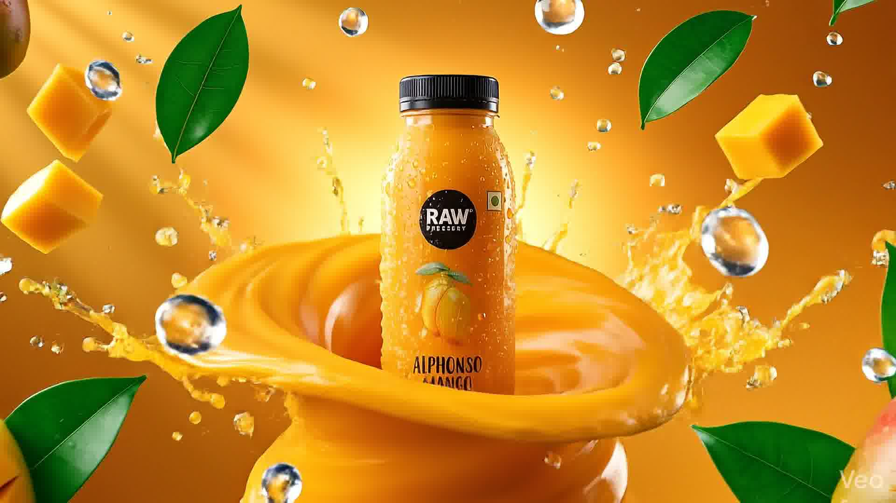

# 🥤 Raw Mango — The Future of Refreshment



## ✨ Overview

Welcome to **Raw Mango**, a premium, high-fidelity 3D scrollytelling experience. This project showcases a cutting-edge product presentation using high-performance image sequence animations, spring-physics interactions, and a modern glassmorphic UI.

Built with **Next.js 16**, **Framer Motion**, and **Tailwind CSS**, it delivers a buttery-smooth narrative as you explore our collection of luxury juices.

---

## 🚀 Key Features

*   **⚡ High-Performance Scrollytelling**: Optimized 3D-like bottle animations synced perfectly with your scroll.
*   **🫧 Fluid Motion**: Implementation of `useSpring` physics for a weightier, more premium feel.
*   **🎨 Dynamic Theming**: Real-time background and accent color transitions based on the selected product.
*   **📱 Fully Responsive**: A seamless experience across mobile, tablet, and desktop.
*   **💎 Modern UI**: Glassmorphism, premium typography, and subtle micro-animations.

---

## 🛠️ Tech Stack

| Technology | Purpose |
| :--- | :--- |
| **Next.js 16** | Core Framework (App Router & Turbopack) |
| **Framer Motion** | Advanced Animations & Spring Physics |
| **Tailwind CSS 4** | Utility-first Styling |
| **Canvas API** | High-speed Image Sequence Rendering |
| **Lucide React** | Premium Iconography |

---

## 📦 Getting Started

### Prerequisites
- Node.js 20+
- npm / yarn / pnpm

### Installation

1.  **Clone the repository**
    ```bash
    git clone https://github.com/ashhabakhtar/first-3d-animated-website-..git
    ```

2.  **Install dependencies**
    ```bash
    npm install
    ```

3.  **Run the development server**
    ```bash
    npm run dev
    ```

4.  **Open the app**
    Navigate to [http://localhost:3000](http://localhost:3000)

---

## 📂 Project Structure

```text
├── src/
│   ├── app/                # Main entry and routing
│   ├── components/         # Reusable UI components
│   │   ├── ProductBottleScroll.tsx   # Core 3D engine
│   │   ├── ProductTextOverlays.tsx   # Animated content
│   │   └── Navbar.tsx      # Premium navigation
│   └── data/               # Product configurations
├── public/                 # Static assets & image sequences
└── tailwind.config.ts      # Design system configuration
```

---

## 🎨 Design Philosophy

The project follows a **"Luxury Tech"** aesthetic:
- **Typography**: Bold, uppercase headings for impact.
- **Color**: High-contrast palettes that shift with the product.
- **Interactivity**: Every interaction feels intentional and smooth.

---

## 🤝 Contributing

Contributions are welcome! If you have ideas for new features or improvements, feel free to open an issue or submit a pull request.

---

## 📄 License

This project is licensed under the MIT License.

---

<p align="center">
  Made with ❤️ by <a href="https://github.com/ashhabakhtar">Ashhab Akhtar</a>
</p>
